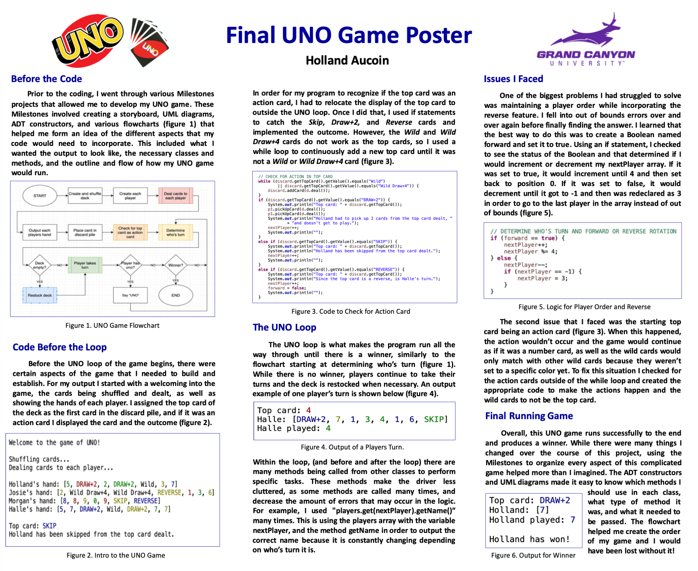
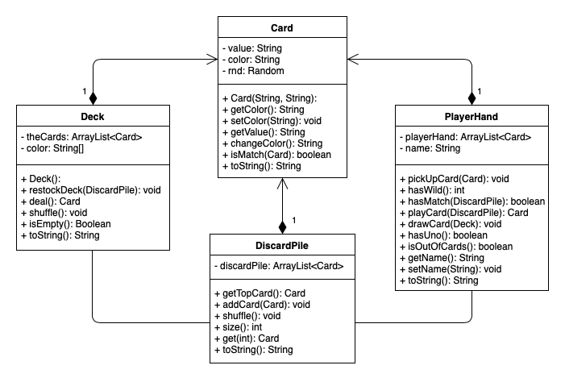

# UNO Game

In the Eclipse IDE, I created an automatic game of UNO using the basic Object-Oriented Programming principles, following the standard rules and logistics of the UNO Card Game. This game has 4 hard coded players that are each dealt a hand of 7 cards, runs through the full game, and determines a winner.

Below is an project overview poster discussing the planning process, coding methods used, the issued I faced while coding, and how the solutions I used to overcome those problems.

	

<h2>Design</h2>

In my application design stages, I created an in-depth flowchart showing all of the steps for each procedure within the main class, as well as a UML diagram to help guide in developing the variables and methods within each class.

<h3>Flowchart<h3>

	

<h3>UML Diagram<h3>

	

